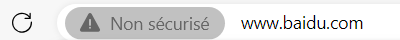
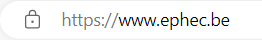
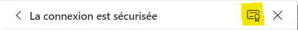

# Exercices HTTP

Les différents exercices présentés dans cette partie visent à comprendre ce qu'est le protocole HTTP et sa version sécurisée HTTPS.

## Exercice 1: Découverte des sites non sécurisés

 1. Ouvre Internet Explorer
 2. Ouvre l'url suivante : https://whynohttps.com/
 3. Choisis une url non sécurisée.
 4. Clique sur l'indication "Non sécurisé" à gauche de la barre de navigation
    
	

 6. Clique sur "La connexion à ce site n’est pas sécurisée" et lis ce qui est indiqué.
 
## Exercice 2: Ouvrir un site Web en HTTP

 1. Ouvre Internet Explorer
 2. Ouvre l'url suivante : http://www.ephec.be/
 3. Une fois la page apparue, qu'observes-tu dans l'url ?
 4. Clique sur le cadenas qui se situe à gauche de la barre de navigation

    

 5. Clique sur "La connexion est sécurisée" et lis ce qui est indiqué
 6. Clique sur l'icône Certificat pour voir le certificat du site de l'EPHEC

    

 7. Par quelle organisation le certificat a-t-il été émis ?
 8. Jusque quand est-il valable ?
 
### Pour aller plus loin

 * [Page Wikipédia sur le HTTP](https://fr.wikipedia.org/wiki/Hypertext_Transfer_Protocol "HTTP")
 * [Page Wikipédia sur le HTTPS (sécurisé)](https://fr.wikipedia.org/wiki/Hypertext_Transfer_Protocol_Secure "HTTPS")
 * [Page Wikipédia sur l'attaque Man In The Middle](https://fr.wikipedia.org/wiki/Attaque_de_l%27homme_du_milieu "Attaque Man In The Middle"), décrivant l'un des problèmes principal à ne pas utiliser sécuriser son site

