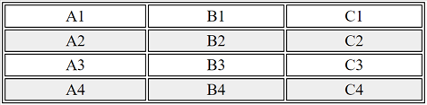

# Exercices PHP - display

## Exercice 1: affichage dynamique de HTML

### Objectifs

 1. Savoir générer du code HTML depuis PHP.

 2. Savoir conditionner du code HTML à l'aide de PHP.

 3. Savoir générer du code HTML depuis une boucle en PHP.


### Enoncés

#### 1. Affichage simple

Générer du code HTML depuis PHP. Pour cela, afficher la valeur d'une variable dans un document HTML.

Exemple: Afficher un nombre généré aléatoirement dans un paragraphe:
 - "Le nombre vaut xx" et afficher la valeur du nombre.

Pour générer un nombre de manière aléatoire en PHP (hors cours), voir la fonction `rand` ([PHP doc - rand](https://www.php.net/manual/fr/function.rand.php)). Exemple, pour générer un nombre compris entre 0 et 10: `$number = rand(0, 10);`.

[Correction](./corrections/a-var/)

#### 2. Affichage conditionné

Conditionner du code HTML à l'aide de PHP. Pour cela, dans un document HTML, conditionner l'affichage d'un paragraphe en fonction de la valeur d'une variable.

Exemple: conditionner deux parapgraphes en fonction d'un nombre généré aléatoirement. 
 - Paragraphe 1, toujours affiché (voir exercice précédent): "Le nombre vaut xx" et afficher la valeur du nombre.
 - Paragraphe 2, affiché si le nombre est supérieur ou égal à 5: "Donc, le nombre est supérieur ou égal à 5".
 - Paragraphe 3 affiché si le nombre est strictement inférieur à 5: "Donc, le nombre est strictement inférieur à 5".

 [Correction](./corrections/b-if/)

#### 3. Affichage en boucle (for)

Afficher un tableau HTML de dimension 4x3 (4 lignes sur 3 colonnes). Ce tableau doit être généré dynamiquement depuis PHP.
  - Chaque ligne doit posséder une classe indiquant si elle est paire ou impaire.
  - Chaque cellule doit contenir un identifiant basé sur le nommage d'Excel (la lettre majuscule de la colonne suivi du numéro de la ligne). Pour la conversion d'un nombre en lettre, utiliser l'expression suivante (hors cours!): `$letter = 'ABCDEFGHIJKLMNOPQRSTUVWXYZ'[$colIndex];`, où `$colIndex` représente l'indice de la colonne à partir de 0.

Exemple d'affichage:

 

[Correction](./corrections/c-for/)

#### 4. Affichage de liste (array indexé à 1 dimension)

Afficher de manière dynamique une liste HTML. Cette liste provient d'un array de string en PHP. Autrement dit, il faut transformer une liste PHP en liste HTML. (Exemple: liste de mes animaux préférés, listes des barbapapas, listes des Schtroumpfs, ...)

[Correction](./corrections/d-list/)

#### 5. Affichage du morpion (array indexé à 2 dimensions)

Reprendre le jeu du morpion et afficher-le dans un tableau HTML. Les lignes gagnantes doivent être colorées en vert.

### Remarques pratiques

#### Afficher du texte

Il existe plusieurs façons d'afficher du texte (du HTML, par exemple) dans un fichier PHP.

##### En dehors des balises PHP

Naturellement, PHP s'inscrit dans du texte. Tout ce qui n'est pas entre des balises PHP est donc du simple texte, non interprété.

```php
<?php 
  // code php
?>
Ceci est du texte.
<?php 
  // code php
?>
```

##### Au sein des balises PHP

Au sein d'un code PHP, il est possible, pour afficher du texte dans le navigateur, d'utiliser notamment la commande `echo` ([PHP doc - echo](https://www.php.net/manual/fr/function.echo.php)). 

```php
<?php 
  echo 'Ceci est du texte.';
?>
```

A noter qu'il existe aussi une syntaxe courte (appelée "short open tag") (hors cours).

```php
<?= 'Ceci est du texte.' ?>
```

#### Contrôle du texte

##### En dehors des balises PHP

De même, on peut contrôler du texte qui se trouve entre deux balises PHP.

###### if

```php
<?php 
  if (true) {
?>
Ceci est visible.
<?php 
  } else {
?>
Ceci n'est PAS visible.
<?php 
  }
?>
```

###### for

```php
<?php 
  for ($i = 0; $i < 5; $i++) {
?>
Ceci est affiché 5 fois.
<?php 
  }
?>
```

###### Syntaxe alternative

A noter (hors cours) qu'il existe une syntaxe alternative des structures de contrôle, particulière à ce cas d'utilisation et plus lisible (voir [PHP doc - syntaxe alternative](https://www.php.net/manual/fr/control-structures.alternative-syntax.php)).
