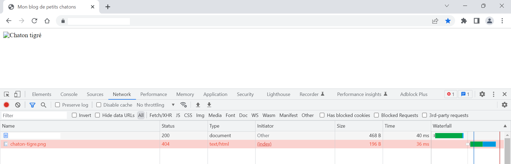
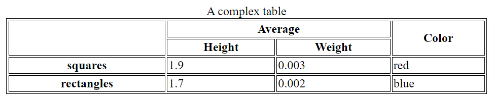

# Exercices HTML

Les différents exercices présentés dans cette partie se complètent les uns les autres, et visent, au final, à créer une sorte de mini site contenant les balises HTML principales. Chaque exercice est donc la suite de celui qui le précède, et représente une nouvelle étape (une nouvelle version) dans la création d'un site en construction. Il est nécessaire d'aborder les exercices dans l'ordre pour une meilleure compréhension.

**Attention:** le code produit doit être validé par le [W3C validator](https://validator.w3.org/). 


## Exercice 1: document de base

 1. Créer un fichier `index.*`.
 2. Veiller à comprendre pour quelle raison ce fichier est ainsi nommé et par quelles URL y accéder en HTTP.
 3. Dans ce fichier, créer la structure de base d'un document HTML.

[Corrections (v1)](./v1)

### Remarques théoriques

#### Charset UTF-8

Le charset est l'encodage du jeux de caractères typographiques utilisés dans l'écriture des langues (caractères visibles et invisibles). (Pour plus d'information, voir [W3.org - characters](https://www.w3.org/International/getting-started/characters).)

L'[UTF-8](https://fr.wikipedia.org/wiki/UTF-8) est un encodage Unicode permettant de supporter les caractères typographiques des principales langues. C'est aujourd'hui le format le plus adapté au web, et devrait être systématiquement utilisé.

A noter que l'UTF-8 est rétrocompatible avec l'ASCII, mais pas avec l'ISO-8859-1, deux anciennes normes.

L'UTF-8 est le jeux de caratères par défaut de HTML5. _A priori_, sa déclaration dans un document HTML n'est donc pas nécessaire. Toutefois, MDN recommande de déclarer systématiquement le jeux de caractères utilisé, notamment pour des raisons de sécurité. (Pour plus d'information, voir [MDN docs - meta](https://developer.mozilla.org/fr/docs/Web/HTML/Element/meta).)

A noter que l'utilisation d'UTF-8 est soumise aux contraintes techniques suivantes:
 - Le fichier contenant le code HTML doit être encodé en UTF-8. Selon moi, le format du fichier doit être déclaré sans BOM (le BOM n'étant pas nécessaire dans le cas d'HTML et pouvant entraîner des perturbations dans l'envoi des headers HTTP par le serveur).
 - La `content-type` de la response HTTP doit déclarer le charset UTF-8, sous peine d'écraser le charset HTML et d'entraîner une incohérence, et ce d'autant plus que la [valeur par défaut](https://www.w3.org/International/articles/http-charset/index) pour HTTP 1.1 est l'ISO-8859-1.
 - La déclaration du charset doit se faire en début de document HTML.

A noter que la définition du charset via l'attribut `http-equiv="Content-Type"` de la balise `meta`  (pragma directive) est autorisée mais dépréciée depuis HTML5 et ne doit donc plus être utilisée. Seul l'attribut `charset` est conforme.

Pour plus d'information sur l'utilisation du charset, voir [W3-org - gestion de l'encodage](https://www.w3.org/International/tutorials/tutorial-char-enc/).

#### Entités HTML

A noter qu'il est possible d'encoder des caractères spéciaux en HTML, appelés entités, notamment pour afficher des caractères qui, sinon, seraient interprétés comme du HTML (ex: "<", ">", ...), ou encore pour des caractères invisibles (ex: espaces insécables, ...). ([MDN docs - entités](https://developer.mozilla.org/fr/docs/Glossary/Entity)) 


## Exercice 2: structures et textes

 1. Dans ce fichier, utiliser des balises de structure, de sorte à:
    - Afficher un en-tête de page/section
    - Afficher un pied de page/section
    - Afficher des articles
 2. Dans ce fichier, utiliser des balises de texte, de sorte à:
    - Afficher des titres de section
    - Afficher des paragraphes
    - Afficher des saut de ligne

[Corrections (v2)](./v2)


## Exercice 3: images

 1. Par ce fichier, afficher des images propres au site (c'est-à-dire se trouvant dans le même [domaine](https://developer.mozilla.org/fr/docs/Learn/Common_questions/Pages_sites_servers_and_search_engines)), via des **chemins relatifs**.

[Corrections (v3)](./v3)

### Remarques théoriques

#### URL

Une URL représente une et une seule ressource.

Une URL se compose d'au moins les parties suivantes:

1. Le schéma
2. Le nom de domaine
3. Le port (optionnel)
4. Le chemin (optionnel)

Il existe plusieurs façons de définir une URL dans le HTML:

1. URL absolue (càd commençant par le schéma)
2. URL relative (à l'URL courante)

Dans le cadre d'une URL relative, il est donc possible de n'indiquer que le chemin.

De même, il existe plusieurs façons de définir, au sein d'une URL, le chemin:
   1. Chemin absolu (ou relatif à la racine)
   2. Chemin relatif (au répertoire courant) (possible uniquement dans une URL relative n'incluant que le chemin)

Dans le cadre de la définition d'un chemin, il faut noter les règles de navigation suivantes:
 - `/` (séparateur de répertoire) indique, utilisé en tête de chemin, le répertoire racine. 
 - `./` (point simple) indique le répertoire courant.
 - `../` (deux points se suivant) indique le répertoire parent. 

### Procédure de débuggage

Si l'image ne s'affiche pas correctement, appliquer la procédure de débuggage suivante:

 1. Valider le code HTML auprès [W3C validator](https://validator.w3.org/).
 2. S'assurer que le fichier d'image à bien été déployé sur le serveur.
 3. Vérifier que le fichier HTML est bien à jour sur le serveur. Pour ce faire, par exemple, inspecter le code affiché à l'aide du DevTools.
 4. Vérifier le chemin de fichier indiqué dans le code HTML. Pour ce faire, dans l'onglet "Network" du DevTools du navigateur, après rafraîchissement de la page, vérifier le statut HTTP du chargement de l'image (Si code `200`, tout est OK. Si code `404`, la ressource n'a pas été trouvée.) 

 

 ### Autres balises média

 A noter qu'il existe d'autres balises média (hors cours):
   - `video`
   - `audio`


## Exercice 4: listes

 1. Créer un fichier `listes.*`.
 2. Veiller à comprendre par quelle URL y accéder en HTTP.
 3. Par ce fichier, afficher 3 types de listes:
    - Liste à puces
    - Liste ordonnée
    - Liste de descriptions

[Corrections (v4)](./v4)


## Exercice 5: tableaux

 1. Créer un fichier `tableaux/index.*`.
 2. Veiller à comprendre par quelle URL y accéder en HTTP.
 3. Par ce fichier, afficher un tableau simple, avec au moins:
    - Plusieurs lignes
    - Plusieurs colonnes
 4. Complexifier le tableau par l'ajout de balises de structure de tableau, avec au moins:
    - Une légende de tableau
    - Un en-tête de tableau
    - Un corps de tableau
    - Un pied de tableau
 5. Complexifier le tableau par la fusion de cellules, avec au moins: 
    - Une fusion de cellules par colonne
    - Une fusion de cellules par ligne

Exemple de tableau complexe:


Pour afficher les bordures du tableau, ainsi qu'une taille de tableau minimale, appliquer le style suivant à la balise `head` de la page:
```html
	<style>
		table {
			min-width: 50%;
		}
		table, th, td {
			border: 1px solid black;
		}
	</style>
```   

[Corrections (v5)](./v5)


## Exercice 6: liens

**Attention:** cet exercice vise à relier entre elles plusieurs pages d'un même site, par l'intermédiaire d'une navigation interne. Il est donc impératif d'avoir créé au préalable plusieurs fichiers HTML. Pour une compréhension totale des **chemins relatifs**, il est important qu'un de ces fichiers soit situés dans un dossier. Se reporter à la [v5](./v5) pour la structure des fichiers.

 1. Dans toutes les pages HTML, ajouter un menu de navigation interne (vers toutes les pages), avec **chemins relatifs**.
 2. Dans une des pages, ajouter un lien vers un website externe (avec **URL absolue**).
 
[Corrections (v6)](./v6)

### Remarques théoriques

### Ancre

On appelle "ancre" la partie visible du lien sur laquelle l'utilisateur est amené à cliquer.

### URL

Voir la remarque sur les URL précédente.

A noter également que, dans le cadre d'une requête HTTP d'un document HTML, si aucun fichier n'est spécifié dans le chemin, le serveur web (tel qu'habituellement configuré) retournera dans la réponse HTTP le contenu d'un fichier `index.*` présent dans le répertoire du chemin (et donc dans le répertoire racine si le chemin n'est pas mentionné du tout dans l'URL).

### Types de lien

A noter qu'il existe plusieurs possibilités de liens (hors cours):
 - Lien à l'interieur d'une page.
 - Lien vers une adresse email.
 - Lien de téléchargement de fichier.
 - Lien ouvrant un nouvel onglet.

## Exercice 7: formulaires

1. Créer un fichier `forms.php`.
2. Veiller à comprendre par quelle URL y accéder en HTTP.

### Champs

#### Texte

1. Par ce fichier, afficher un formulaire contenant les champs suivants, accompagnés de leurs légendes respectives:
   - Texte simple (+ placeholder)
   - Mot de passe
   - Email (+ placeholder)
   - Téléphone (+ placeholder)
   - Submit et reset
2. Afficher de manière brute les données reçues par le serveur lors de la soumission du formulaire, et tâcher de les comprendre.

#### Choix à réponse unique

1. Par ce fichier, afficher un formulaire contenant les champs suivants, accompagnés de leurs légendes respectives:
   - Radio multiples
   - Select à sélection unique (+ optgroup)
   - Select à sélection unique avec un choix sélectionné par défaut
   - Submit et reset
2. Afficher de manière brute les données reçues par le serveur lors de la soumission du formulaire, et tâcher de les comprendre.

#### Choix à réponses multiples

1. Par ce fichier, afficher un formulaire contenant les champs suivants, accompagnés de leurs légendes respectives:
   - Checkbox multiples
   - Checkbox unique checkée par défaut
   - Submit et reset
2. Afficher de manière brute les données reçues par le serveur lors de la soumission du formulaire, et tâcher de les comprendre.

#### Caché

1. Par ce fichier, afficher un formulaire contenant les champs suivants:
   - Caché
   - Submit et reset
2. Afficher de manière brute les données reçues par le serveur lors de la soumission du formulaire, et tâcher de les comprendre.

#### Divers

1. Par ce fichier, afficher un formulaire contenant les champs suivants:
   - Textarea
   - Nombre
   - Range
   - Submit et reset
2. Afficher de manière brute les données reçues par le serveur lors de la soumission du formulaire, et tâcher de les comprendre.

### Remarques théoriques

#### Focus

Le focus détermine l'élement HTML écoutant la saisie de l'utilisateur. Par exemple, dans le cadre d'un formulaire, si un utilisateur saisit du texte à partir de son clavier, seul le champ bénéficiant du focus (et dans lequel, en l'occurrence, se trouve le curseur de texte) sera mis à jour. 

#### Label

Idéalament, chaque champ de formulaire est associé à une légende (`label`) qui lui est propre. En cliquant sur la légende, le focus est mis sur le champ associé.

#### CSS

A noter, pour aller plus loin (notions avancées), l'existence, en CSS, de plusieurs pseudo-class dédiées aux formulaires (`:focus`, `:checked`, `:disabled`, `:invalid`, ...).

#### HTTP

L'objectif d'un formulaire est de soumettre des données au serveur web. Par conséquent, la bonne compréhension des formulaires implique l'utilisation du protocole HTTP afin de simuler un comportement réel. (Si, dans un navigateur, il est possible d'afficher un document HTML local via une URL de schéma `file`, le protocole HTTP nécessite de passer par une URL de schema `http` ou `https`.)

Avertissement: les formulaires peuvent contenir des données sensibles, lesquelles vont transiter de manière publique sur Internet. Dans un cadre de production (site réel), pour des raisons de sécurité, il est impératif de n'utiliser que le protocole HTTPS, seul garant de (notamment) la confidentiallité et l'intégrité des données. De toute façon, d'une manière générale, il est recommandé d'utiliser systématiquement HTTPS.

#### Débuggage des données

Pour afficher de manière brute les données réceptionnées par le serveur web, on peut se servir, par exemple, de PHP:

```php
<pre>
   <?php print_r($_POST); ?>
</pre>
```

Il est important de veiller à ce que l'association `name` => `value` de chaque champ HTML soumis se retrouve correctement dans les données reçues par le serveur (`$_POST`), en particulier dans le cadre de choix multiples.


 
